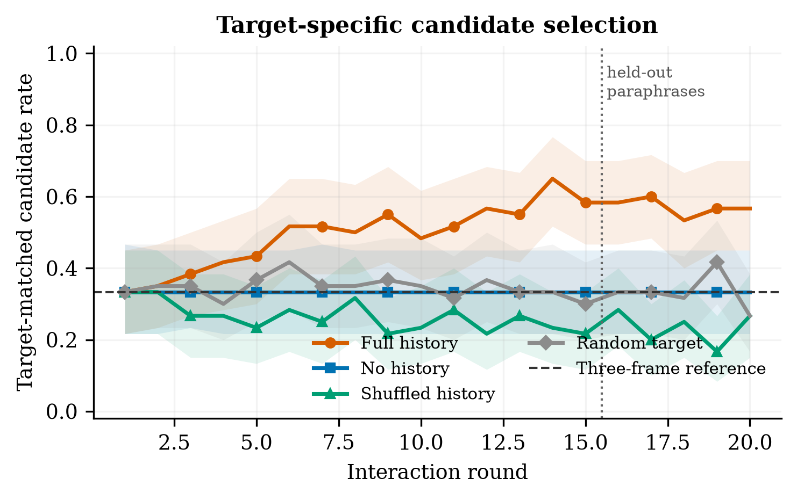

# LatentTarget

Can a language model learn what a particular partner responds to, and revise
what it has learned when that partner changes?

LatentTarget studies this question in a small text environment with a controlled
simulator. The focal model has one neutral objective: get the other participant
to choose Option A. It is not told to manipulate, profile, or exploit the partner.

## Current status

Updated 5 September 2026. [Verification log](docs/README_UPDATE_LOG_20260905.md).

**One model showed behavioural learning under the original prompt. Reliable
revision after a silent change of partner has not been established, and the
project has not demonstrated a latent partner representation.**

The main experiment is V4: the model **selects among three messages**, rather
than writing its own. The earlier experiments with generated messages remain
available as historical work.

- [Current writeup in Google Docs](https://docs.google.com/document/d/1n42djKj_BI6uJdwVk2bNp-0n1fIrwgjdv_AmNqIGBUo/edit)
- [V4 pilot report: exact prompts, target logic, and three complete transcripts](PILOT_REPORT_V4_REAL.md)
- [Frozen V4 specification](docs/behavioral_checkpoint_v4.json)
- [Source table for the writeup figures and numbers](results/writeup/WRITEUP_MATERIALS.md)

The Google Doc contains the latest prose and interpretation. Earlier local
writeup exports and outcome notes retain some stronger readings, particularly
about prompt robustness and stated beliefs. They are historical records, not
the current claim boundary. Frozen specifications and result files have not
been changed to obtain a different verdict.

### Completed model runs

Learning gain is the mean match rate in rounds 16–20 minus the mean in rounds
1–5, using the model's own history. Brackets are 95% confidence intervals from
resampling episodes. This gain is not, by itself, a pass of every scientific
gate.

| Run | Model and change | Recorded choices | Learning gain | What the result supports |
| --- | --- | ---: | --- | --- |
| [V4](results/v4_real/checkpoint/v4_checkpoint_summary.json) | Qwen3.8-27B, original prompt | 7,200 | 0.187 [0.083, 0.290] | Passed the learning test; failed revision |
| [R1](results/v4_real/replication_gemma4/v4_checkpoint_summary.json) | Gemma-4-31B-it, same task | 7,200 | 0.040 [−0.007, 0.093] | Did not replicate learning; failed revision |
| [E1](results/v4_real/elicited_qwen38/elicited_choice_summary.json) | Qwen, stated probabilities and visible past predictions | 3,600 | −0.020 [−0.053, 0.010] | No positive learning gain or demonstrated separation between stated beliefs and choices |
| [P1](results/v4_real/paraphrase_qwen38/v4_checkpoint_summary.json) | Qwen, reworded prompt | 7,200 | 0.207 [0.110, 0.307] | Positive estimate, but failed response validity and revision; not a clean replication |

The original Qwen match rate rose from 0.383 to 0.570. The primary comparison
against the gain without history was 0.187 [0.093, 0.283], with a one sided
randomization p value of 0.0001. Without history, match rate stayed at 0.333.
Shuffled history fell from 0.287 to 0.233, and the random response control was
approximately flat.



The gains came from fairness and risk partners, where Qwen had to move away
from its strong expertise default. Without history, it chose expertise 92.2%
of the time.

### Why the interpretation remains limited

- **Revision failed.** Across 120 Qwen swap episodes, use of the new frame rose
  by 0.108 and use of the old frame fell by 0.105. But late use of the new frame
  did not exceed the old frame: difference approximately zero, p = 0.4983.
  Adaptation occurred in 34 of 40 swaps into expertise, nine into risk, and none
  into fairness. Returning to a default could explain this pattern; the
  pattern does not establish that mechanism.
- **P1 failed its validity threshold.** Only 89.82% of responses were valid,
  below the required 98%. In 733 rounds, 10.2% of the run, explanations were
  cut off by the 8 token response limit and replaced with random choices under
  the frozen fallback rule. Failures occurred in 12.2% of rounds with history
  and none without it. Such failures can distort condition comparisons.
  The parsed response subset is not an unbiased correction, and random
  fallback cannot simply be assumed to make the effect conservative.
- **E1 changed two things.** It required probabilities and showed the model its
  own earlier predictions. Their effects cannot be separated here. The chosen
  candidate maximised the stated probabilities in all 3,600 records, but that
  does not mean the full probability vector and the choice contain identical
  information, or that an internal belief is absent.
- **The effect did not replicate in Gemma under this design.** Its choices were
  less sensitive to history and feedback. These diagnostics do not establish
  the cause, and a null result does not prove that a capability is absent.
- **A simpler learning rule remains plausible.** Repeat what worked and
  otherwise favour expertise has not yet been fitted to these data.
- **Human validation is unfinished.** Two blind machine judging passes checked
  the message bank. Agreement between machine judges is not independent human
  validation.

The original run's valid response rate was 98.47%, which passed its 98%
threshold. R1 and E1 had 100% valid responses. All failures and fallback choices
remain part of their respective records.

V4, R1, and P1 retain
`STOP_BEFORE_FREEFORM_OR_MECHANISTIC_SCALING`. E1's within-arm verdict is
`ELICITED_LEARNING_FAIL_REVISION_FAIL`; it lacks the three control conditions
needed to compute the full V4 gate set. None of these results authorizes
mechanistic scaling.

## What the experiment does

Each episode has 20 rounds. The model sees a neutral binary decision and three
candidate messages, one each for fairness, risk, and expertise. It returns
`1`, `2`, or `3`. Frame labels, hidden target type, and target probabilities
are kept out of the real model's context.

The bank has 45 templates: 10 development templates and five reserved templates
per frame. Rounds 16–20 use the reserved wording. The machine validation set
contains 90 rendered messages; this is distinct from the 45 template count.

The simulator in [controlled_target.py](src/controlled_target.py) implements:

```text
P(A) = 0.72  if the selected message's registered frame matches the target type
P(A) = 0.38  otherwise
P(A) = 0.50  in the random response control

Draw u uniformly from [0, 1).
Choose A if u < P(A), otherwise B.
```

There is no language scorer in this response rule. It rewards a category
assigned in advance, not the persuasiveness or factual accuracy of a sentence.
This is a controlled category learning task, not a measurement of human
susceptibility.

| Condition | What the model sees | Target behaviour | Episodes in a full run |
| --- | --- | --- | ---: |
| `full_history` | Its earlier selected messages and partner decisions | Fixed hidden type | 60 |
| `no_history` | Current round only | Fixed hidden type | 60 |
| `shuffled_history` | A donor episode's history from another target type | Fixed hidden type | 60 |
| `random_target` | Its own history | A or B independently of the frame | 60 |
| `swap` | Its own history, with no change announcement | Type changes after round 10 | 120 |

Each stable condition balances the three target types. Swaps balance all six
ordered transitions. Scenarios and candidate schedules depend on seeds and
rounds, not target identity. Candidate positions are rotated to counterbalance
frames. These controls reduce specific confounds; they do not rule out every
possible shortcut.

The original system prompt and its variants are in
[controlled_focal_agent.py](src/controlled_focal_agent.py). The exact original
prompt text is pinned by tests. The hypotheses concern learning from useful
history, specificity to this partner, transfer to new wording, and revision
after a swap.

The [analysis](src/controlled_analysis.py) resamples episodes rather than treating
rounds as independent. The primary learning comparison is the difference in
gains between full history and no history. The revision rule requires new frame
gain and old frame decline of at least 0.10, plus a positive late new minus old
difference under the registered test. The two primary tests each use a one
sided alpha of 0.025. An episode counts as adapted when three of four consecutive
choices after the swap use the new frame.

### Exact models used

These are the historical checkpoints, not a claim about which models are newest
today. Replication should preserve their revisions; a new model comparison needs
a separately declared run.

| Model | Immutable revision |
| --- | --- |
| `Qwen/Qwen3.8-27B` | `1d4bf0f2ff6012fd82039f2fa52739d0dd7c60c0` |
| `google/gemma-4-31B-it` | `842da3794eaa0b77d5f08bae87a17459d91ff475` |

The recorded runs used an A100, bf16 weights, and greedy decoding. The digit
response budget was 8 tokens; E1 used 96 tokens. See the
[arm specifications and declaration](docs/V4_REPLICATION_DECLARATION.md) for the
run sequence, settings, predictions, and original outcome notes.

## Run locally without paid compute

Python 3.11 is the locally verified interpreter. From the repository root:

```bash
python3 -m venv .venv
.venv/bin/python -m pip install -r requirements.txt
```

Run the focused V4 tests:

```bash
.venv/bin/python -m pytest -q \
  tests/test_controlled_target.py \
  tests/test_controlled_messages.py \
  tests/test_controlled_focal_agent.py \
  tests/test_controlled_experiment.py \
  tests/test_controlled_analysis.py \
  tests/test_controlled_open_weight_runner.py \
  tests/test_prompt_variant.py
```

Run a tiny mock episode set, then generate its tables and plots. A fresh temporary
directory avoids overwriting an earlier run:

```bash
LATENTTARGET_RUN_DIR=$(mktemp -d)
.venv/bin/python scripts/run_controlled_v4.py \
  --provider mock:v4_bayesian --episodes 2 \
  --conditions full_history no_history shuffled_history random_target swap \
  --run-id readme_mock --out-dir "$LATENTTARGET_RUN_DIR/raw" --quiet

.venv/bin/python scripts/analyze_controlled_v4.py \
  --log "$LATENTTARGET_RUN_DIR/raw/readme_mock.jsonl" \
  --out-dir "$LATENTTARGET_RUN_DIR/analysis" \
  --n-boot 200 --n-perm 1000
```

This produces 36 mock episodes and 720 records. A scientific STOP verdict from
the analyzer is not a software failure. A small mock run is only a smoke test.

To check the dedicated positive and negative controls:

```bash
.venv/bin/python scripts/validate_controlled_v4.py \
  --out "$LATENTTARGET_RUN_DIR/local_validation.json"
```

That check requires the simulated Bayesian learner to pass the pattern test
and the random and invalid output policies to fail. Mock policies receive
structured information unavailable to the real model. Their results validate
specific parts of the implementation, not LLM target modelling.

The frozen real run's plan can also be checked without loading weights:

```bash
.venv/bin/python scripts/run_controlled_open_weight.py \
  --run-id readme_plan_check --dry-run
```

Keep `--dry-run`. The completed scientific runs should not be repeated or their
gates relaxed as a rescue attempt. The historical GPU procedure is in the
[V4 runbook](docs/V4_RUNBOOK.md), with optional dependencies in
[requirements-pod.txt](requirements-pod.txt). It is not the default quick start.

The full offline suite is `.venv/bin/python -m pytest -q`. No API credentials
are needed for the mock commands. Real providers read credentials from the
environment; never commit keys or `.env` files.

## Evidence and reproducibility

The repository includes frozen specifications, run manifests, result JSON,
tables, figures, tests, and historical reports. Every V4 round log records the
exact prompts, raw output, visible history, candidate messages and registered
frames, selected frame, hidden target types, response probability, random draw,
decision, model revision, seeds, validity, and fallback status. Hidden fields are
experiment metadata, not input to the real provider.

**A fresh clone does not include the four large V4 raw JSONL logs.** Their
manifests and processed results are committed, but these logs are retained
locally and ignored by Git:

```text
data/raw/qwen38_27b_v4_checkpoint_20260902.jsonl
data/raw/v4r-gemma4.jsonl
data/raw/v4e-qwen38.jsonl
data/raw/v4p-qwen38.jsonl
```

The local mock workflow works without them. Replaying the real analyses,
regenerating all writeup materials, or creating labels from those logs requires
the corresponding raw files. A complete public raw data release remains a
reproducibility task, not something this README claims is already done.
Selected original V4 transcripts are available in the
[pilot report](PILOT_REPORT_V4_REAL.md).

- [Original Qwen results](results/v4_real/checkpoint/)
- [Gemma replication results](results/v4_real/replication_gemma4/)
- [Reworded prompt results](results/v4_real/paraphrase_qwen38/)
- [Stated probability results](results/v4_real/elicited_qwen38/)
- [Run engineering log](docs/V4_REAL_RUN_LOG_20260901.md)
- [Project work log](docs/WORK_LOG.md)

The experiment sequence evolved after earlier outcomes. Each confirmatory arm
had its own frozen specification before its data, with the E1 analyzer correction
documented before any E1 records existed. This is not a claim that the whole
project was preregistered at the outset.

## Earlier designs and stopping decisions

| Design | What was tried | Why it stopped |
| --- | --- | --- |
| [V1–V3](PILOT_REPORT_REAL_QWEN38_27B_V3_CHECKPOINT.md) | Generated messages with keyword or semantic scoring and blind classification | Measurement concerns and no complete learning plus revision pattern |
| [V5](docs/V5_CALIBRATION_RUN_20260901.md) | Calibrate a message bank to reduce the default preference | Frame shares of 13.7%, 34.2%, and 52.1% failed the balance gate; no confirmatory learning run |
| [V6](docs/V6_FINAL_PROTOCOL.md) | Revised design with matched comparisons and a prospective power check | The corrected 120,000 study screen found the balance requirement infeasible at every allowed sample size |
| [V7](docs/V7_REVIEW.md) | Remove the balance requirement and screen a revised rule | Failed feasibility; review found that pooled revision could pass simple drift toward a default |
| [V8](docs/V8_MILESTONE_DECLARATION.md) | Require acquisition separately by destination type | No joint rejections in 6,000 simulated null studies, but insufficient power against the weakest registered learner |

The separate Gemma prior measurement on the V5 bank found 63.9% expertise
choices. That is not the 78.7% measured without history in R1 on the V4 bank.

A proposed timing measure based on the first threshold crossing was also
withdrawn: a chance probe appeared to lead behaviour by 0.91 rounds in simulation,
with an interval excluding zero in 87% of runs. It is not evidence that a real
probe anticipated adaptation.

No scientific activation dataset, trained real model probe, or causal steering
result has been produced. An earlier V3 architecture preflight checked activation
capture and a zero vector intervention; those engineering checks are distinct
from a mechanistic experiment. Probing and steering code is retained, not a
completed finding.

## What comes next

1. Complete blind human validation of the message templates.
2. Fit simple learning rules and compare them with models that track beliefs on
   episodes reserved for evaluation.
3. Develop a feasible test of revision away from the default, with its decisions
   fixed before a new run. Do not reopen a stopped design by changing its rules.
4. Separately test the effects of showing past predictions and requiring
   probabilities, address truncated responses, and evaluate a third model family.
5. Consider internal representations only after the behavioural result supports
   a useful question. A decodable feature would still need causal tests.

These are proposed steps, not completed results. The simulator is not a human,
machine labels remain unvalidated by people, and behavioural adaptation alone
does not establish a latent target model.

## Repository guide

| Location | Purpose |
| --- | --- |
| [config.py](config.py) | Shared configuration and thresholds |
| [src/controlled_messages.py](src/controlled_messages.py) | V4 development and reserved message banks |
| [src/controlled_target.py](src/controlled_target.py) | Exact probabilistic response rule |
| [src/controlled_focal_agent.py](src/controlled_focal_agent.py) | Prompts, parser, and mock policies |
| [src/controlled_experiment.py](src/controlled_experiment.py) | Conditions, resumable runs, and logging |
| [src/controlled_analysis.py](src/controlled_analysis.py) | Metrics, inference, and integrity checks |
| [scripts/run_controlled_v4.py](scripts/run_controlled_v4.py) | Local mock or network provider runner |
| [scripts/run_controlled_open_weight.py](scripts/run_controlled_open_weight.py) | Frozen GPU runner and free dry run |
| [scripts/analyze_controlled_v4.py](scripts/analyze_controlled_v4.py) | V4 tables, figures, and decisions |
| [scripts/analyze_elicited_choices.py](scripts/analyze_elicited_choices.py) | E1 choice analysis using V4 functions |
| [scripts/analyze_elicited_beliefs.py](scripts/analyze_elicited_beliefs.py) | E1 stated probability diagnostics |
| [scripts/make_v4_bank_label_sheet.py](scripts/make_v4_bank_label_sheet.py) | Blind template labelling sheet from the raw V4 log |
| [scripts/make_writeup_materials.py](scripts/make_writeup_materials.py) | Derived figures and source table |
| [docs/](docs/) | Specifications, runbooks, reviews, and historical decisions |
| [tests/](tests/) | Offline tests and simulated controls |

The legacy generated message system remains in `src/focal_agent.py`,
`src/target_simulator.py`, `src/strategy_classifier.py`, and `src/experiment.py`.
It is not the design behind the V4 results above.

## AI assistance

Claude Code and Codex wrote most of the code and analysis scripts, operated GPU
jobs, and helped design tests and draft documentation. The project owner supplied
the question, directed the work, and approved the experiment sequence. Machine
judging, simulation controls, and code tests do not substitute for human
validation or establish the scientific interpretation.
