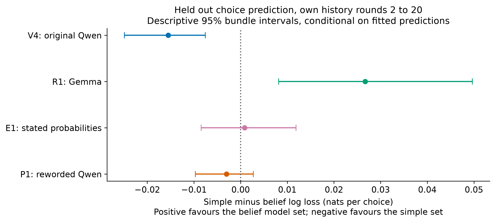
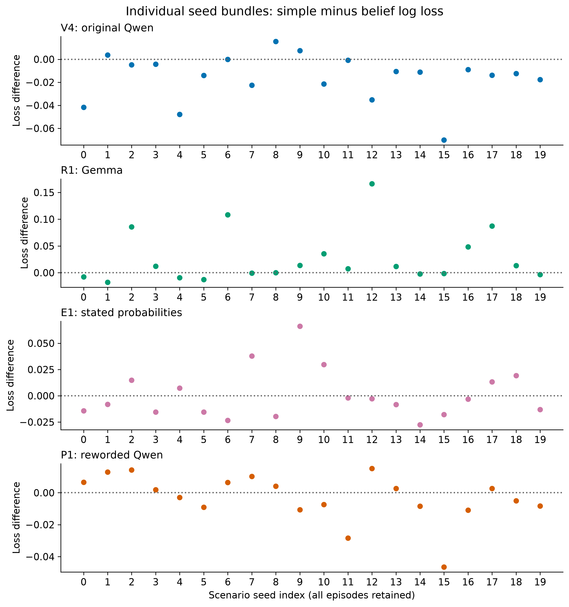

# Can simpler rules explain these choices?

## Scope

Exploratory analysis of existing logs. No new model generations or paid compute.
Every prediction is from a model fitted and selected without that episode's seed bundle.
The comparison predicts choices, not hidden representations or deployment reward.

## Main comparison

Rounds 2 to 20 with own history, giving stable and swap conditions equal weight.
Lower log loss is better. The difference is simple minus belief, so a positive
difference favours the belief model set. Both sets are selected in inner validation.

| Run | Simple log loss | Belief log loss | Difference [descriptive 95% interval] | Simple accuracy | Belief accuracy |
| --- | ---: | ---: | --- | ---: | ---: |
| V4 | 0.4973 | 0.5128 | -0.0155 [-0.0249, -0.0076] | 80.9% | 79.9% |
| R1 | 0.2017 | 0.1750 | +0.0267 [+0.0082, +0.0497] | 94.4% | 95.6% |
| E1 | 0.2127 | 0.2118 | +0.0009 [-0.0085, +0.0119] | 93.7% | 93.5% |
| P1 | 0.7338 | 0.7368 | -0.0030 [-0.0097, +0.0027] | 68.6% | 67.4% |

Intervals resample whole seed bundles while holding fitted predictions fixed.
They do not include retraining uncertainty. Overlapping training folds can correlate
the predictions. These are descriptive exploratory intervals, not significance tests.

## All model families

All scores below use the same outer test rows. A family's parameters are chosen
without its outer test rows. The selected set is not picked using this table.

### V4

| Model | Log loss | Brier score | Accuracy |
| --- | ---: | ---: | ---: |
| uniform | 1.0986 | 0.6667 | 33.3% |
| expertise | 1.4841 | 0.5771 | 70.6% |
| marginal | 0.7904 | 0.4553 | 70.6% |
| repeat_last | 0.5967 | 0.3260 | 79.3% |
| win_stay_expertise | 0.6577 | 0.3642 | 78.4% |
| history_frequency | 0.5613 | 0.3001 | 80.8% |
| reward_learning | 0.4973 | 0.2735 | 80.9% |
| belief_static | 0.5161 | 0.2860 | 80.1% |
| belief_dynamic | 0.5128 | 0.2856 | 79.9% |
| simple_selected | 0.4973 | 0.2735 | 80.9% |
| belief_selected | 0.5128 | 0.2856 | 79.9% |

simple_selected across outer folds: reward_learning: 5.

belief_selected across outer folds: belief_dynamic: 5.

| Condition | Rows | Invalid responses | Simple loss | Belief loss |
| --- | ---: | ---: | ---: | ---: |
| full_history | 1200 | 24 | 0.5173 | 0.5290 |
| no_history | 1200 | 0 | 0.4661 | 0.4661 |
| random_target | 1200 | 15 | 0.5064 | 0.5309 |
| shuffled_history | 1200 | 24 | 0.5222 | 0.5350 |
| swap | 2400 | 47 | 0.4773 | 0.4965 |

Counts include round 1. Condition prediction scores use rounds 2 to 20.

Detailed tables: [V4/metrics.csv](V4/metrics.csv), [V4/contrasts.csv](V4/contrasts.csv),
[V4/calibration.csv](V4/calibration.csv), [V4/fold_audit.json](V4/fold_audit.json).

### R1

| Model | Log loss | Brier score | Accuracy |
| --- | ---: | ---: | ---: |
| uniform | 1.0986 | 0.6667 | 33.3% |
| expertise | 0.4803 | 0.1834 | 90.7% |
| marginal | 0.3666 | 0.1736 | 90.7% |
| repeat_last | 0.1915 | 0.0872 | 94.9% |
| win_stay_expertise | 0.2707 | 0.1196 | 93.9% |
| history_frequency | 0.2097 | 0.1011 | 93.5% |
| reward_learning | 0.1792 | 0.0805 | 95.7% |
| belief_static | 0.1750 | 0.0772 | 95.6% |
| belief_dynamic | 0.1897 | 0.0911 | 94.2% |
| simple_selected | 0.2017 | 0.0946 | 94.4% |
| belief_selected | 0.1750 | 0.0772 | 95.6% |

simple_selected across outer folds: reward_learning: 3, history_frequency: 2.

belief_selected across outer folds: belief_static: 5.

| Condition | Rows | Invalid responses | Simple loss | Belief loss |
| --- | ---: | ---: | ---: | ---: |
| full_history | 1200 | 0 | 0.1886 | 0.1590 |
| no_history | 1200 | 0 | 0.7054 | 0.7248 |
| random_target | 1200 | 0 | 0.2147 | 0.1978 |
| shuffled_history | 1200 | 0 | 0.1886 | 0.1590 |
| swap | 2400 | 0 | 0.2147 | 0.1910 |

Counts include round 1. Condition prediction scores use rounds 2 to 20.

Detailed tables: [R1/metrics.csv](R1/metrics.csv), [R1/contrasts.csv](R1/contrasts.csv),
[R1/calibration.csv](R1/calibration.csv), [R1/fold_audit.json](R1/fold_audit.json).

### E1

| Model | Log loss | Brier score | Accuracy |
| --- | ---: | ---: | ---: |
| uniform | 1.0986 | 0.6667 | 33.3% |
| expertise | 0.3334 | 0.1258 | 93.6% |
| marginal | 0.2533 | 0.1220 | 93.6% |
| repeat_last | 0.2148 | 0.1087 | 92.4% |
| win_stay_expertise | 0.2365 | 0.1162 | 92.9% |
| history_frequency | 0.1969 | 0.0966 | 94.2% |
| reward_learning | 0.2155 | 0.1118 | 93.2% |
| belief_static | 0.2151 | 0.1096 | 93.4% |
| belief_dynamic | 0.2118 | 0.1088 | 93.5% |
| simple_selected | 0.2127 | 0.1053 | 93.7% |
| belief_selected | 0.2118 | 0.1088 | 93.5% |

simple_selected across outer folds: history_frequency: 4, reward_learning: 1.

belief_selected across outer folds: belief_dynamic: 5.

| Condition | Rows | Invalid responses | Simple loss | Belief loss |
| --- | ---: | ---: | ---: | ---: |
| elicited_full_history | 1200 | 0 | 0.2184 | 0.2164 |
| elicited_swap | 2400 | 0 | 0.2071 | 0.2073 |

Counts include round 1. Condition prediction scores use rounds 2 to 20.

Detailed tables: [E1/metrics.csv](E1/metrics.csv), [E1/contrasts.csv](E1/contrasts.csv),
[E1/calibration.csv](E1/calibration.csv), [E1/fold_audit.json](E1/fold_audit.json).

### P1

| Model | Log loss | Brier score | Accuracy |
| --- | ---: | ---: | ---: |
| uniform | 1.0986 | 0.6667 | 33.3% |
| expertise | 2.3104 | 0.9012 | 54.0% |
| marginal | 0.9662 | 0.5839 | 54.0% |
| repeat_last | 0.8727 | 0.5166 | 62.4% |
| win_stay_expertise | 0.8928 | 0.5329 | 61.7% |
| history_frequency | 0.8255 | 0.4830 | 65.3% |
| reward_learning | 0.7338 | 0.4264 | 68.6% |
| belief_static | 0.7548 | 0.4356 | 68.0% |
| belief_dynamic | 0.7368 | 0.4282 | 67.4% |
| simple_selected | 0.7338 | 0.4264 | 68.6% |
| belief_selected | 0.7368 | 0.4282 | 67.4% |

simple_selected across outer folds: reward_learning: 5.

belief_selected across outer folds: belief_dynamic: 5.

| Condition | Rows | Invalid responses | Simple loss | Belief loss |
| --- | ---: | ---: | ---: | ---: |
| full_history | 1200 | 148 | 0.7324 | 0.7403 |
| no_history | 1200 | 0 | 0.7364 | 0.7364 |
| random_target | 1200 | 165 | 0.8256 | 0.8297 |
| shuffled_history | 1200 | 148 | 0.7508 | 0.7594 |
| swap | 2400 | 272 | 0.7351 | 0.7333 |

Counts include round 1. Condition prediction scores use rounds 2 to 20.

Detailed tables: [P1/metrics.csv](P1/metrics.csv), [P1/contrasts.csv](P1/contrasts.csv),
[P1/calibration.csv](P1/calibration.csv), [P1/fold_audit.json](P1/fold_audit.json).

## Checks and limitations

- The original design audit and the new history reconstruction checks passed for every included run.
- All candidate families produced finite, positive, normalized probabilities for every row.
- Donors, recipients, conditions and all rounds with the same seed index remained in one fold.
- Invalid responses stay in the primary score. The valid response subset uses the same fitted models and is not an unbiased correction.
- The baselines receive explicit frame annotations. The belief models also receive the true typed target likelihoods. Neither advantage was given to the LLM.
- The E1 comparison omits its past stated probabilities, which the LLM could see.
- The split holds out seed bundles, not unseen templates or a scientifically untouched dataset.
- A predictive advantage cannot establish an internal mechanism. A small difference cannot establish equivalence.
- The finite grids may miss better parameter values or a more suitable model family.
- No result changes the original validity, learning, revision or mechanistic scaling gates.

## Diagnostics and reproducibility

The metric table includes mean, SD, median, range and IQR outlier counts across
seed bundles. No outliers were removed. Gaussian errors and equal variance are not
assumed. Calibration bins are descriptive and do not pretend that rounds are independent.

Each run directory also contains predictions.csv.gz with all probabilities and scores,
and summary.json. The top level manifest records input and analysis hashes, versions,
fold settings and output hashes. Raw messages are not copied into these outputs.

The raw V4 family JSONL logs are local and are not tracked in Git. A fresh clone
can run the synthetic tests, but reproducing this real data comparison requires those logs.
