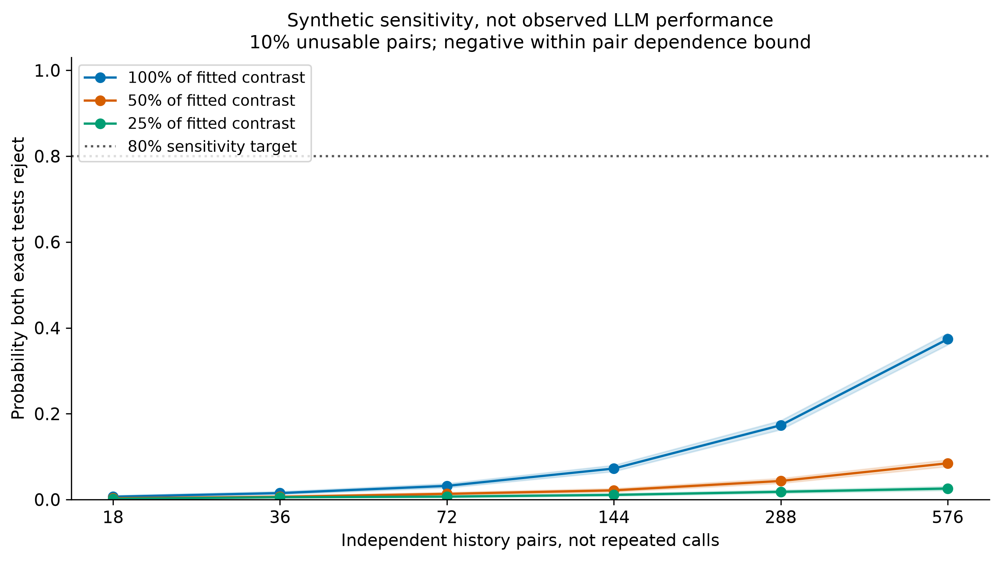
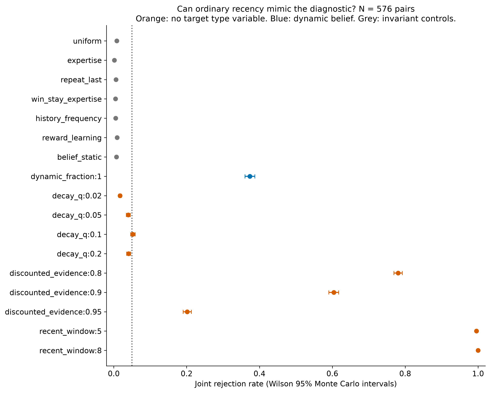

# Matched history diagnostic: local feasibility

## Outcome

Sensitivity verdict: **INSUFFICIENT_SENSITIVITY_WITHIN_CEILING**.

Interpretation verdict: **NOT_SPECIFIC_TO_PARTNER_BELIEFS**.

No paid model calls were made. These are mathematical predictions and synthetic studies,
not new LLM results. The original experiments and their stopping rules are unchanged.

## What is matched

The fixed bank contains 576 unique history pairs. Each pair has two 18 observation
histories with the same six outcomes per frame, three successes per frame, and the same
per frame outcome order. The final three observations are also identical. Only the
interleaving between categories changes. The text rendering keeps the same messages,
scenarios, reward associations and current candidates within the pair.

Chosen action reward learning is exactly invariant for any learning rate. Static beliefs,
counts and repetition are invariant too. A dynamic belief model can change its prediction.
Global recency rules can also change, despite never representing a target type.

## Prospective sensitivity

Two one sided exact paired tests must pass at alpha = 0.025 each: the pooled contrast
and the contrast restricted to fairness and risk focus pairs. The sample unit is the
history pair, not each prompt or a duplicate greedy call. The table uses the 50% contrast
with 10% unusable pairs, taking the weaker lower interval bound across two coupling scenarios.

| Pairs | Planned calls including shams | Minimum required power lower | Maximum invariant null upper | Sensitivity and nulls pass |
| --- | ---: | ---: | ---: | --- |
| 18 | 48 | 0.000 | 0.017 | False |
| 36 | 96 | 0.004 | 0.020 | False |
| 72 | 192 | 0.011 | 0.024 | False |
| 144 | 384 | 0.018 | 0.029 | False |
| 288 | 768 | 0.038 | 0.028 | False |
| 576 | 1536 | 0.077 | 0.029 | False |

Smallest qualifying tested sample: none within the fixed ceiling.



There are 5,000 synthetic studies per scenario and sample size.
The fitted contrast is not assumed to transfer exactly to a greedy LLM. We report nominal,
half and quarter effects, independent sampling and the negative dependence bound, with
zero or 10% random pair loss. These are sensitivity assumptions, not empirical estimates
of future response noise. Informative format errors would require separate handling.

## Specificity challenge

The prespecified check uses N = 576. The following table reports the highest joint
rejection rate across the declared coupling and loss scenarios for each ordinary recency
policy. All scenario rows are retained in power.csv. The main test is about order
invariance, so these are not false positives under that narrow null. They are
counterexamples to interpreting a positive result as evidence uniquely for partner beliefs.

| Policy without a target type state | Highest joint rejection | 95% Monte Carlo interval |
| --- | ---: | --- |
| decay_q:0.02 | 2.2% | [1.8%, 2.6%] |
| decay_q:0.05 | 5.8% | [5.2%, 6.5%] |
| decay_q:0.1 | 9.1% | [8.3%, 9.9%] |
| decay_q:0.2 | 6.1% | [5.4%, 6.8%] |
| discounted_evidence:0.8 | 93.3% | [92.6%, 94.0%] |
| discounted_evidence:0.9 | 80.0% | [78.9%, 81.1%] |
| discounted_evidence:0.95 | 34.0% | [32.7%, 35.3%] |
| recent_window:5 | 100.0% | [99.9%, 100.0%] |
| recent_window:8 | 100.0% | [99.9%, 100.0%] |



## Closed set synthetic recovery

At N = 576, the rows below show identification of the exact generating mathematical policy
by maximum predictive likelihood. All 17 fixed policies were candidates. Ties count as unresolved.
These numbers assume the true rule is in the candidate set. They are not evidence
that an actual LLM uses any one of these algorithms.

| Generating policy | Correct identification | Most frequent assigned label |
| --- | ---: | --- |
| belief_dynamic | 82.5% | belief_dynamic |
| belief_static | 0.0% | unresolved_tie |
| decay_q:0.02 | 40.5% | decay_q:0.02 |
| decay_q:0.05 | 30.1% | decay_q:0.05 |
| decay_q:0.1 | 33.7% | decay_q:0.1 |
| decay_q:0.2 | 66.9% | decay_q:0.2 |
| discounted_evidence:0.8 | 100.0% | discounted_evidence:0.8 |
| discounted_evidence:0.9 | 99.2% | discounted_evidence:0.9 |
| discounted_evidence:0.95 | 63.6% | discounted_evidence:0.95 |
| expertise | 100.0% | expertise |
| history_frequency | 0.0% | unresolved_tie |
| recent_window:5 | 100.0% | recent_window:5 |
| recent_window:8 | 100.0% | recent_window:8 |
| repeat_last | 100.0% | repeat_last |
| reward_learning | 68.9% | reward_learning |
| uniform | 100.0% | uniform |
| win_stay_expertise | 100.0% | win_stay_expertise |

Recovery uses independent categorical draws, no dropout, and one fixed rule per dataset.
It is deliberately separated from the primary paired sign test and its conservative
coupling and loss checks. Good closed set recovery cannot repair a nonspecific primary test.
With balanced counts, static beliefs and history frequency produce identical predictions
under the shared choice settings. Their unresolved ties are structural nonidentifiability,
not a failed implementation. Other near matches also limit recovery.

## What is ready and what is not

The candidate pool, all selected histories, fixed predictions, allocation, prompt exports,
tests and CPU simulation outputs are ready for inspection. No provider runner or paid
deployment is included. Exact prompts for the first pair of each focus frame are in
[SAMPLE_PROMPTS.md](SAMPLE_PROMPTS.md). Every prompt was constructed, not generated by a focal agent.

The intervention changes the distribution of histories and their chronological order.
It measures responses to supplied history, not naturally acquired online partner models.
It cannot establish latent representations, human persuasion, or causal mechanisms inside an LLM.
The independent human semantic validation gate remains unfinished.

The declared local screen ends here. Do not extend the sample grid or weaken a requirement
to obtain a pass. Any narrower follow up requires an explicit claim, reviewed design and
new approval before paid calls. Model availability and a current checkpoint would also
need verification then; the reference probabilities here come from historical V4 fits.

## Reproduce

```bash
.venv/bin/python scripts/design_history_diagnostic.py \
  --out-dir results/history_diagnostic_replay
```

The output directory must not already exist. The script uses saved baseline fit summaries,
not raw model logs, credentials, model weights or a GPU. The manifest records inputs, source
and output hashes. CSV tables retain every scenario, not just the cases in these figures.
