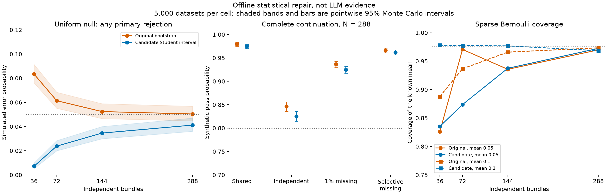
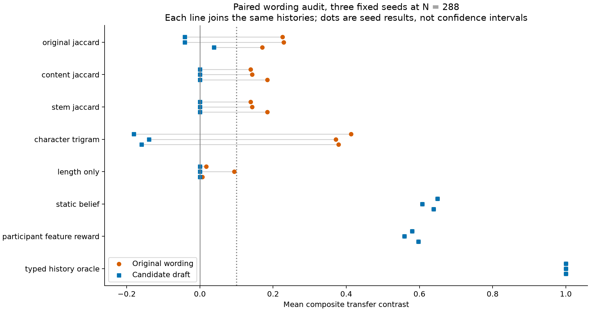

# Bounded repair: complete offline results

Candidate statistical screen: **OFFLINE_SENSITIVITY_PASS**.

**Overall project remains unapproved for deployment or mechanistic claims.** These are synthetic policies and simulated datasets, not new LLM results. Paid calls and GPU deployments: zero.

## What ran

One fixed interval candidate was compared with the original bootstrap on 280,000 fresh datasets. A separate 160,000 datasets checked nonzero coverage. Analyzing both methods does not double the number of independent datasets.
The paired text audit saved 41,472 undispatched prompts and 331,776 synthetic responses, covering eight policies, two wording banks and three fixed seeds. All failures are retained.

## Statistical decision at the sample ceiling

Passing grid values for the candidate: [288]. This is conditional on the fixed synthetic screen, not universal calibration or a real model power estimate.

Each primary uses alpha 0.025. Three controls must show equivalence within plus or minus 0.10, both primary lower mean bounds must reach 0.10, and all choice branches must have at least 98% validity. Pointwise 95% Wilson intervals quantify Monte Carlo uncertainty; they are not simultaneous intervals across this table.

| Scenario | Original complete pass [MC interval] | Candidate complete pass [MC interval] | Candidate any primary rejection [MC interval] |
| --- | --- | --- | --- |
| uniform_null | 0.0000 [0.0000, 0.0008] | 0.0000 [0.0000, 0.0008] | 0.0412 [0.0360, 0.0471] |
| global_reward_null | 0.0000 [0.0000, 0.0008] | 0.0000 [0.0000, 0.0008] | 0.0000 [0.0000, 0.0008] |
| global_recency_null | 0.0000 [0.0000, 0.0008] | 0.0000 [0.0000, 0.0008] | 0.0000 [0.0000, 0.0008] |
| name_bias_null | 0.0000 [0.0000, 0.0008] | 0.0000 [0.0000, 0.0008] | 0.0000 [0.0000, 0.0008] |
| belief_full | 0.7266 [0.7141, 0.7388] | 0.6948 [0.6819, 0.7074] | 1.0000 [0.9992, 1.0000] |
| belief_half_shared | 0.9794 [0.9751, 0.9830] | 0.9748 [0.9701, 0.9788] | 1.0000 [0.9992, 1.0000] |
| belief_half_independent | 0.8462 [0.8359, 0.8559] | 0.8254 [0.8146, 0.8357] | 1.0000 [0.9992, 1.0000] |
| belief_half_mcar_1pct | 0.9366 [0.9295, 0.9430] | 0.9248 [0.9172, 0.9318] | 1.0000 [0.9992, 1.0000] |
| belief_half_selective_1pct | 0.9664 [0.9610, 0.9710] | 0.9622 [0.9565, 0.9671] | 1.0000 [0.9992, 1.0000] |
| belief_mcar_3pct | 0.0000 [0.0000, 0.0008] | 0.0000 [0.0000, 0.0008] | 1.0000 [0.9992, 1.0000] |
| feature_reward | 0.6736 [0.6605, 0.6865] | 0.6416 [0.6282, 0.6548] | 1.0000 [0.9992, 1.0000] |
| dynamic_belief | 0.6840 [0.6710, 0.6967] | 0.6472 [0.6338, 0.6603] | 1.0000 [0.9992, 1.0000] |
| expertise_heavy_null | 0.0000 [0.0000, 0.0008] | 0.0000 [0.0000, 0.0008] | 0.0406 [0.0355, 0.0464] |
| shared_sparse_null | 0.0000 [0.0000, 0.0008] | 0.0000 [0.0000, 0.0008] | 0.0424 [0.0372, 0.0483] |

## Why the variance repair helps, and where it does not

For equal stratum size m, the conditional empirical bootstrap variance is (m minus one)/m times the sample variance based estimate of mean uncertainty. At N = 36, m = 6 and the factor is 5/6. At N = 288 it is 47/48. The archived summaries compare both estimates against empirical variance across fresh study means. This identifies one source of small sample undercoverage, not necessarily its whole cause.
The candidate uses the minimum stratum degrees of freedom, giving a conservative Student critical factor. It remains an approximation. Sample variance unbiasedness presumes independent, identically distributed observations within strata; fixed allocation heterogeneity can add conservative variation. Neither argument establishes general confidence coverage for arbitrary discrete distributions.
In particular, a sparse sample with no observed successes can have zero estimated variance and a point interval. The following diagnostic outcomes are retained even when the selected null screen clears. Nominal marginal coverage is 0.975.

| Distribution | True mean | N | Original coverage [MC interval] | Candidate coverage [MC interval] | Zero variance rate | Candidate observed threshold continuation |
| --- | ---: | ---: | --- | --- | ---: | ---: |
| bernoulli | 0.05 | 36 | 0.8262 [0.8154, 0.8365] | 0.8352 [0.8247, 0.8452] | 0.1648 | 0.0000 |
| bernoulli | 0.05 | 72 | 0.9706 [0.9655, 0.9749] | 0.8736 [0.8641, 0.8825] | 0.0248 | 0.0248 |
| bernoulli | 0.05 | 144 | 0.9356 [0.9285, 0.9421] | 0.9374 [0.9303, 0.9438] | 0.0000 | 0.0044 |
| bernoulli | 0.05 | 288 | 0.9698 [0.9647, 0.9742] | 0.9724 [0.9675, 0.9766] | 0.0000 | 0.0004 |
| bernoulli | 0.1 | 36 | 0.8878 [0.8788, 0.8963] | 0.9782 [0.9738, 0.9819] | 0.0218 | 0.0180 |
| bernoulli | 0.1 | 72 | 0.9366 [0.9295, 0.9430] | 0.9772 [0.9727, 0.9810] | 0.0002 | 0.4470 |
| bernoulli | 0.1 | 144 | 0.9658 [0.9604, 0.9705] | 0.9768 [0.9722, 0.9806] | 0.0000 | 0.4740 |
| bernoulli | 0.1 | 288 | 0.9734 [0.9686, 0.9775] | 0.9684 [0.9632, 0.9729] | 0.0000 | 0.4996 |
| bernoulli | 0.2 | 36 | 0.9314 [0.9241, 0.9381] | 0.9838 [0.9799, 0.9869] | 0.0004 | 0.3514 |
| bernoulli | 0.2 | 72 | 0.9506 [0.9442, 0.9563] | 0.9784 [0.9740, 0.9821] | 0.0000 | 0.9806 |
| bernoulli | 0.2 | 144 | 0.9678 [0.9625, 0.9723] | 0.9782 [0.9738, 0.9819] | 0.0000 | 0.9998 |
| bernoulli | 0.2 | 288 | 0.9772 [0.9727, 0.9810] | 0.9802 [0.9760, 0.9837] | 0.0000 | 1.0000 |
| bernoulli | 0.3 | 36 | 0.9548 [0.9487, 0.9602] | 0.9932 [0.9905, 0.9951] | 0.0000 | 0.8356 |
| bernoulli | 0.3 | 72 | 0.9644 [0.9589, 0.9692] | 0.9838 [0.9799, 0.9869] | 0.0000 | 0.9998 |
| bernoulli | 0.3 | 144 | 0.9674 [0.9621, 0.9720] | 0.9766 [0.9720, 0.9804] | 0.0000 | 1.0000 |
| bernoulli | 0.3 | 288 | 0.9710 [0.9660, 0.9753] | 0.9778 [0.9733, 0.9815] | 0.0000 | 1.0000 |
| signed_bernoulli | 0.05 | 36 | 0.9544 [0.9483, 0.9598] | 0.9952 [0.9929, 0.9968] | 0.0000 | 0.0052 |
| signed_bernoulli | 0.05 | 72 | 0.9628 [0.9572, 0.9677] | 0.9864 [0.9828, 0.9893] | 0.0000 | 0.0208 |
| signed_bernoulli | 0.05 | 144 | 0.9710 [0.9660, 0.9753] | 0.9804 [0.9762, 0.9839] | 0.0000 | 0.0372 |
| signed_bernoulli | 0.05 | 288 | 0.9720 [0.9671, 0.9762] | 0.9762 [0.9716, 0.9801] | 0.0000 | 0.0732 |
| signed_bernoulli | 0.1 | 36 | 0.9460 [0.9394, 0.9519] | 0.9954 [0.9931, 0.9969] | 0.0000 | 0.0128 |
| signed_bernoulli | 0.1 | 72 | 0.9702 [0.9651, 0.9746] | 0.9892 [0.9859, 0.9917] | 0.0000 | 0.0502 |
| signed_bernoulli | 0.1 | 144 | 0.9698 [0.9647, 0.9742] | 0.9818 [0.9777, 0.9852] | 0.0000 | 0.1156 |
| signed_bernoulli | 0.1 | 288 | 0.9770 [0.9725, 0.9808] | 0.9820 [0.9779, 0.9853] | 0.0000 | 0.2648 |
| signed_bernoulli | 0.2 | 36 | 0.9540 [0.9478, 0.9595] | 0.9940 [0.9914, 0.9958] | 0.0000 | 0.0486 |
| signed_bernoulli | 0.2 | 72 | 0.9592 [0.9534, 0.9643] | 0.9870 [0.9835, 0.9898] | 0.0000 | 0.2246 |
| signed_bernoulli | 0.2 | 144 | 0.9692 [0.9640, 0.9736] | 0.9804 [0.9762, 0.9839] | 0.0000 | 0.5086 |
| signed_bernoulli | 0.2 | 288 | 0.9752 [0.9705, 0.9792] | 0.9778 [0.9733, 0.9815] | 0.0000 | 0.8680 |
| signed_bernoulli | 0.3 | 36 | 0.9438 [0.9371, 0.9498] | 0.9946 [0.9922, 0.9963] | 0.0000 | 0.1468 |
| signed_bernoulli | 0.3 | 72 | 0.9618 [0.9561, 0.9668] | 0.9888 [0.9855, 0.9914] | 0.0000 | 0.5390 |
| signed_bernoulli | 0.3 | 144 | 0.9680 [0.9628, 0.9725] | 0.9786 [0.9742, 0.9823] | 0.0000 | 0.9016 |
| signed_bernoulli | 0.3 | 288 | 0.9712 [0.9662, 0.9755] | 0.9786 [0.9742, 0.9823] | 0.0000 | 0.9988 |

The 0.10 observed mean requirement is not a test that the true effect exceeds 0.10. At a true mean of 0.10, only about half of estimates exceed that threshold even with strong detection against zero. These marginal checks do not include the full control gate.

## Wording results, every policy and seed

Each training body has eight whitespace words; each new candidate body has three eight word clauses. This equalizes word lengths, not model token lengths, character patterns or semantic validity. Mathematical references retain privileged registered frames or type access. Their unchanged results across banks are an implementation check, not evidence that an LLM understands both banks.

| Seed | Policy | Original BIND / TRANSFER | Draft BIND / TRANSFER | Original / draft complete candidate gate |
| --- | --- | --- | --- | --- |
| 202609082 | original_jaccard | 0.5938 / 0.2257 | 0.6007 / -0.0417 | True / False |
| 202609082 | content_jaccard | 0.5833 / 0.1389 | 0.5833 / 0.0000 | True / False |
| 202609082 | stem_jaccard | 0.5833 / 0.1389 | 0.5833 / 0.0000 | True / False |
| 202609082 | character_trigram | 0.5885 / 0.4132 | 0.5920 / -0.1806 | True / False |
| 202609082 | length_only | 0.5851 / 0.0174 | 0.0000 / 0.0000 | False / False |
| 202609082 | static_belief | 0.5833 / 0.6493 | 0.5833 / 0.6493 | True / True |
| 202609082 | participant_feature_reward | 0.5712 / 0.5799 | 0.5712 / 0.5799 | True / True |
| 202609082 | typed_history_oracle | 1.0000 / 1.0000 | 1.0000 / 1.0000 | True / True |
| 202609083 | original_jaccard | 0.5990 / 0.2292 | 0.5920 / -0.0417 | True / False |
| 202609083 | content_jaccard | 0.5903 / 0.1424 | 0.5903 / 0.0000 | True / False |
| 202609083 | stem_jaccard | 0.5903 / 0.1424 | 0.5903 / 0.0000 | True / False |
| 202609083 | character_trigram | 0.5903 / 0.3715 | 0.5781 / -0.1389 | True / False |
| 202609083 | length_only | 0.5764 / 0.0938 | 0.0000 / 0.0000 | False / False |
| 202609083 | static_belief | 0.5903 / 0.6076 | 0.5903 / 0.6076 | True / True |
| 202609083 | participant_feature_reward | 0.6024 / 0.5590 | 0.6024 / 0.5590 | True / True |
| 202609083 | typed_history_oracle | 1.0000 / 1.0000 | 1.0000 / 1.0000 | True / True |
| 202609084 | original_jaccard | 0.5955 / 0.1701 | 0.6076 / 0.0382 | True / False |
| 202609084 | content_jaccard | 0.6389 / 0.1840 | 0.6389 / 0.0000 | True / False |
| 202609084 | stem_jaccard | 0.6389 / 0.1840 | 0.6389 / 0.0000 | True / False |
| 202609084 | character_trigram | 0.6198 / 0.3785 | 0.6250 / -0.1597 | False / False |
| 202609084 | length_only | 0.6198 / 0.0069 | 0.0000 / 0.0000 | False / False |
| 202609084 | static_belief | 0.6389 / 0.6389 | 0.6389 / 0.6389 | True / True |
| 202609084 | participant_feature_reward | 0.6146 / 0.5972 | 0.6146 / 0.5972 | False / False |
| 202609084 | typed_history_oracle | 1.0000 / 1.0000 | 1.0000 / 1.0000 | True / True |

## Interpretation and next boundary

None of the five frozen shallow policies passed the draft's positive complete gate. However, the character trigram policy had consistently negative transfer. An invertible lexical cue remains plausible. We did not add a reversed policy after seeing these outputs, and absence of a positive pass is not absence of lexical information.
The additive simulator also remains compatible with participant specific feature reward learning. This legitimate alternative passes on some seeds without requiring a latent belief about target type. More model calls on this draft would not by themselves distinguish those explanations.
The messages name fairness, caution or competence criteria without establishing why Option A satisfies those criteria. Their semantic validity therefore remains uncertain. The unlabelled export has 54 complete candidate messages and a separate analyst key; no human review was performed.
The next checkpoint should review those messages, freeze a separate evaluation bank, and preregister lexical adversaries that can learn or reverse mappings on development data. A future test should distinguish reward value from target belief if that stronger claim remains the aim. This is a recommendation, not another redesign or a paid run launched by this report.
No finding here demonstrates silent updating, a hidden representation, a causal internal mechanism, general persuasion ability or suitability for a particular research program. Historical failed gates and negative findings remain unchanged.
