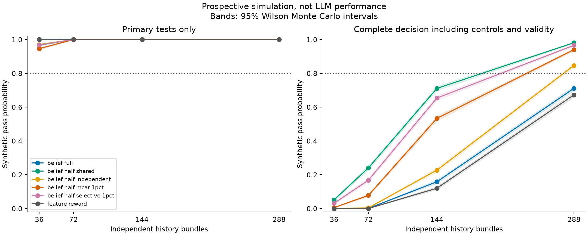

# Partner study offline screen

Status: **OFFLINE_SCREEN_NO_GO**.

These are mathematical mock policies and synthetic studies, not LLM results. No paid calls ran.
The original design snapshot and historical scientific gates are unchanged.

## What ran

Prepared 288 confirmation bundles and 6912 requests, all undispatched.
Evaluated 13 mock policies on that fixed bank.
Ran 240,000 fresh simulated studies across 48 declared cells.

## Complete decision versus primary tests

A primary pass alone is insufficient. The complete decision also requires three control equivalence intervals and 98% validity in every choice branch.
Monte Carlo intervals describe uncertainty in simulated pass rates, not uncertainty about real LLM performance.

| Scenario | N | Both primary | All controls | Validity | Complete pass [95% MC interval] |
| --- | ---: | ---: | ---: | ---: | --- |
| uniform_null | 36 | 0.001 | 0.000 | 1.000 | 0.000 [0.000, 0.001] |
| uniform_null | 72 | 0.001 | 0.000 | 1.000 | 0.000 [0.000, 0.001] |
| uniform_null | 144 | 0.000 | 0.000 | 1.000 | 0.000 [0.000, 0.001] |
| uniform_null | 288 | 0.000 | 0.279 | 1.000 | 0.000 [0.000, 0.001] |
| global_reward_null | 36 | 0.000 | 1.000 | 1.000 | 0.000 [0.000, 0.001] |
| global_reward_null | 72 | 0.000 | 1.000 | 1.000 | 0.000 [0.000, 0.001] |
| global_reward_null | 144 | 0.000 | 1.000 | 1.000 | 0.000 [0.000, 0.001] |
| global_reward_null | 288 | 0.000 | 1.000 | 1.000 | 0.000 [0.000, 0.001] |
| global_recency_null | 36 | 0.000 | 1.000 | 1.000 | 0.000 [0.000, 0.001] |
| global_recency_null | 72 | 0.000 | 1.000 | 1.000 | 0.000 [0.000, 0.001] |
| global_recency_null | 144 | 0.000 | 1.000 | 1.000 | 0.000 [0.000, 0.001] |
| global_recency_null | 288 | 0.000 | 1.000 | 1.000 | 0.000 [0.000, 0.001] |
| name_bias_null | 36 | 0.000 | 0.000 | 1.000 | 0.000 [0.000, 0.001] |
| name_bias_null | 72 | 0.000 | 0.000 | 1.000 | 0.000 [0.000, 0.001] |
| name_bias_null | 144 | 0.000 | 0.003 | 1.000 | 0.000 [0.000, 0.001] |
| name_bias_null | 288 | 0.000 | 0.401 | 1.000 | 0.000 [0.000, 0.001] |
| belief_full | 36 | 1.000 | 0.000 | 1.000 | 0.000 [0.000, 0.001] |
| belief_full | 72 | 1.000 | 0.001 | 1.000 | 0.001 [0.000, 0.002] |
| belief_full | 144 | 1.000 | 0.158 | 1.000 | 0.158 [0.148, 0.169] |
| belief_full | 288 | 1.000 | 0.711 | 1.000 | 0.711 [0.698, 0.724] |
| belief_half_shared | 36 | 0.968 | 0.055 | 1.000 | 0.052 [0.046, 0.058] |
| belief_half_shared | 72 | 1.000 | 0.240 | 1.000 | 0.240 [0.229, 0.252] |
| belief_half_shared | 144 | 1.000 | 0.711 | 1.000 | 0.711 [0.698, 0.723] |
| belief_half_shared | 288 | 1.000 | 0.981 | 1.000 | 0.981 [0.977, 0.985] |
| belief_half_independent | 36 | 0.971 | 0.000 | 1.000 | 0.000 [0.000, 0.001] |
| belief_half_independent | 72 | 1.000 | 0.004 | 1.000 | 0.004 [0.002, 0.006] |
| belief_half_independent | 144 | 1.000 | 0.227 | 1.000 | 0.227 [0.216, 0.239] |
| belief_half_independent | 288 | 1.000 | 0.847 | 1.000 | 0.847 [0.837, 0.857] |
| belief_half_mcar_1pct | 36 | 0.946 | 0.020 | 0.381 | 0.005 [0.004, 0.008] |
| belief_half_mcar_1pct | 72 | 1.000 | 0.103 | 0.700 | 0.077 [0.070, 0.085] |
| belief_half_mcar_1pct | 144 | 1.000 | 0.567 | 0.928 | 0.533 [0.520, 0.547] |
| belief_half_mcar_1pct | 288 | 1.000 | 0.945 | 0.995 | 0.940 [0.933, 0.946] |
| belief_half_selective_1pct | 36 | 0.968 | 0.036 | 0.829 | 0.031 [0.027, 0.037] |
| belief_half_selective_1pct | 72 | 1.000 | 0.169 | 0.984 | 0.167 [0.157, 0.178] |
| belief_half_selective_1pct | 144 | 1.000 | 0.654 | 1.000 | 0.654 [0.640, 0.667] |
| belief_half_selective_1pct | 288 | 1.000 | 0.966 | 1.000 | 0.966 [0.961, 0.971] |
| belief_mcar_3pct | 36 | 1.000 | 0.000 | 0.000 | 0.000 [0.000, 0.001] |
| belief_mcar_3pct | 72 | 1.000 | 0.000 | 0.000 | 0.000 [0.000, 0.001] |
| belief_mcar_3pct | 144 | 1.000 | 0.000 | 0.000 | 0.000 [0.000, 0.001] |
| belief_mcar_3pct | 288 | 1.000 | 0.177 | 0.000 | 0.000 [0.000, 0.001] |
| feature_reward | 36 | 1.000 | 0.000 | 1.000 | 0.000 [0.000, 0.001] |
| feature_reward | 72 | 1.000 | 0.000 | 1.000 | 0.000 [0.000, 0.001] |
| feature_reward | 144 | 1.000 | 0.120 | 1.000 | 0.120 [0.111, 0.129] |
| feature_reward | 288 | 1.000 | 0.673 | 1.000 | 0.673 [0.659, 0.685] |
| dynamic_belief | 36 | 1.000 | 0.000 | 1.000 | 0.000 [0.000, 0.001] |
| dynamic_belief | 72 | 1.000 | 0.000 | 1.000 | 0.000 [0.000, 0.001] |
| dynamic_belief | 144 | 1.000 | 0.115 | 1.000 | 0.115 [0.106, 0.124] |
| dynamic_belief | 288 | 1.000 | 0.683 | 1.000 | 0.683 [0.670, 0.696] |

## Mock policies on the saved bank

One fixed bank per policy. These results test the pipeline and alternative explanations; they are not power estimates.

| Policy | BIND mean | TRANSFER mean | NEAR mean | Complete mock pass |
| --- | ---: | ---: | ---: | --- |
| expertise | 0.000 | 0.000 | 0.000 | False |
| fixed_slot | 0.000 | 0.000 | 0.000 | False |
| name_bias | 0.000 | 0.000 | 0.000 | False |
| uniform | -0.008 | 0.049 | 0.025 | False |
| global_reward | 0.000 | 0.000 | 0.000 | False |
| global_recency | 0.000 | 0.000 | 0.000 | False |
| participant_reward | 0.622 | 0.587 | 0.622 | True |
| participant_recency | 0.436 | 0.448 | 0.436 | True |
| participant_feature_reward | 0.622 | 0.517 | 0.622 | True |
| static_belief | 0.599 | 0.622 | 0.599 | True |
| dynamic_belief | 0.622 | 0.615 | 0.622 | True |
| lexical_retrieval | 0.595 | 0.194 | 0.104 | True |
| typed_history_oracle | 1.000 | 1.000 | 1.000 | True |

## Decision and limitations

Conditional sample candidate: None. This is not permission to deploy.
The required sensitivity scenarios and sample ceiling were written before this screen. No failed scenario was removed.
The finite convolution computes the marginal empirical bootstrap distribution, not exact population coverage. Null rejection rates are separately recorded in power_summary.json.
The mathematical policies have frame annotations and known likelihoods where declared. They do not model a real LLM's language understanding.
Development and confirmation use disjoint aliases, scenario families and exact wording. Semantic family independence and human validity remain unverified.
The additive composite rule remains an assumption. No new model has been selected; no activation experiment is authorized.
Shared versus independent mixture routing and selective invalidity are explicit stress assumptions, not estimates from old LLM results.
The selective scenario uses 3% invalidity for a fairness dominant choice and zero otherwise. Its overall missing fraction need not equal the nominal 1% label; actual branch validity is reported.
All planned requests, mock responses, per-study decisions, plans and hashes are archived. Full event arrays for Monte Carlo studies are deterministically regenerated from the saved config and cell seeds.
